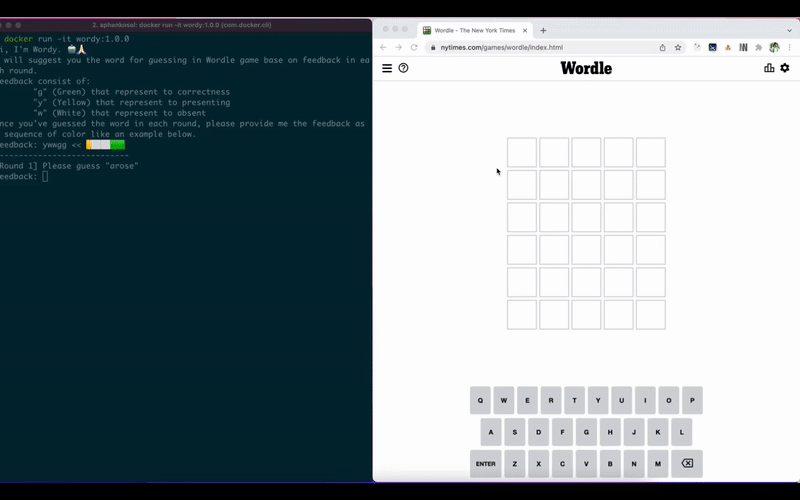

# wordy
Console interaction program to solve Wordle game https://www.nytimes.com/games/wordle/index.html



## Example interaction message
```
Hi, I'm Wordy. 🤖🙏🏻
I will suggest you the word for guessing in Wordle game base on feedback in each round.
Feedback consist of:
	"g" (Green) represents to "correct"
	"y" (Yellow) represents to "present"
	"w" (White) represents to "absent"
Once you've guessed the word in each round, please provide me the feedback as a sequence of color like an example below.
feedback: ywwgg << 🟨⬜⬜🟩🟩
----------------------------
Finding the most suitable word... (This process takes long time)
[Round 1] Please guess "arose"
Feedback: wgwwg
⬜🟩⬜⬜🟩

Finding the most suitable word... (This process takes long time)
[Round 2] Please guess "pubic"
Feedback: wwyyw
⬜⬜🟨🟨⬜

Finding the most suitable word... (This process takes long time)
[Round 3] Please guess "stand"
Feedback: wwwgw
⬜⬜⬜🟩⬜

Finding the most suitable word... (This process takes long time)
[Round 4] Please guess "brine"
Feedback: ggggg
🟩🟩🟩🟩🟩

Hoolay!! We win within round 4 🎉
```

## Build and run

### To run locally:

Clone this repo using **git-lfs** then perform these command
```
poetry install
pyhon main.py
```

### To build/run docker container:
```bash
$> docker build -t wordy:1.0.0 -f docker/Dockerfile .
$> docker run -it wordy:1.0.0
```
